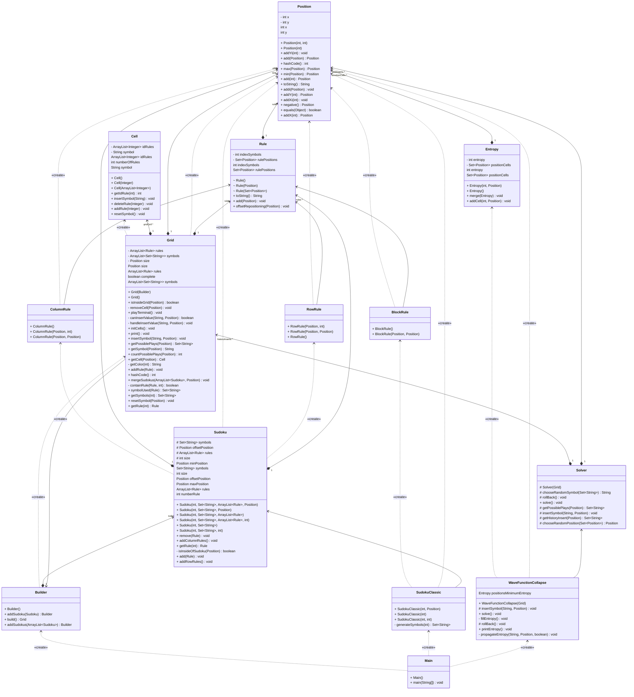

# Sudoku

Bulid the project :
```bash
./gradlew build
```

Run the project :
```bash
./gradlew run --console=plain -q
```

## Project structure

```
sudoku/
│
├── README.md
├── app/src
│   ├── main/java/sudoku/
│   │   ├── Grid.java
│ [gradlew](gradlew)  │   ├── Cell.java
│   │   ├── Constraint.java
│   │   ├── Zone.java
│   │   ├── Rule.java
│   │   ├── Element.java
│   │   └── Main.java
│   │
│   └── test/java/sudoku/
│       ├── GridTest.java
│       ├── CellTest.java
│       ├── ConstraintTest.java
│       ├── ZoneTest.java
│       ├── RuleTest.java
│       └── ElementTest.java
│
├── build/
├── .gitignore
└── LICENSE
```

