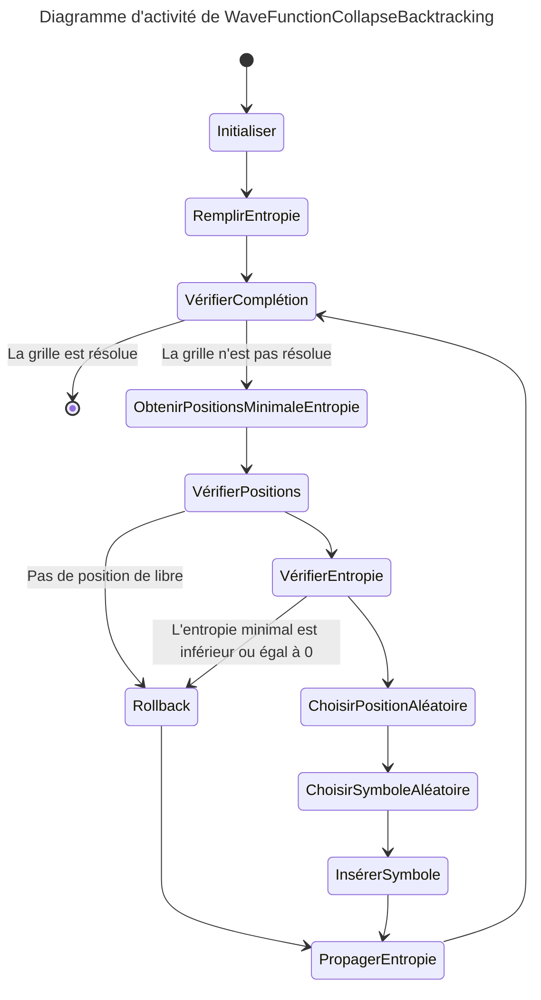

```mermaid
classDiagram
   direction BT
   class Backtrack {
      + Backtrack(Grid)
      + solve() void
      - backtrack(int, int) boolean
      int numberOfSolutions
   }
   class BacktrackOptimized {
      + BacktrackOptimized(Grid)
      - invalidateCache(Position) void
      - validateAndPropagate(Position) boolean
      + solve() void
      # rollBack() void
      - findMostConstrainedCell() Position
      - findHiddenSingles(Position) Set~Position~
      - isForwardCheckValid(Position) boolean
      - getPossiblePlaysWithCache(Position) Set~String~
      - backtrackMinimumRemainingValues() boolean
      - eliminateNakedPairs(Rule) void
      int numberOfSolutions
   }
   class BlockRule {
      + BlockRule(Set~Position~)
      + BlockRule()
      + BlockRule(Position, Position)
   }
   class Builder {
      + Builder()
      + addSudokus(ArrayList~Sudoku~) Builder
      + addSudoku(Sudoku) Builder
      + build() Grid
   }
   class Cell {
      + Cell()
      + Cell(ArrayList~Integer~)
      + Cell(Integer)
      - String symbol
      - ArrayList~Integer~ idRules
      + addRule(Integer) void
      + insertSymbol(String) void
      + deleteRule(Integer) void
      + getNumberOfPrintableRules(ArrayList~Rule~) int
      + getIdRule(int) int
      + resetSymbol() void
      ArrayList~Integer~ idRules
      String symbol
      int numberOfRules
   }
   class Colors {
      + Colors()
   }
   class ColumnRule {
      + ColumnRule(Position, int)
      + ColumnRule(Position, Position)
      + ColumnRule(Set~Position~)
      + ColumnRule()
   }
   class Entropy {
      + Entropy()
      + Entropy(int, Position)
      - Set~Position~ positionCells
      - int entropy
      + addCell(int, Position) void
      + merge(Entropy) void
      Set~Position~ positionCells
      int entropy
   }
   class GenerateSudoku {
      + GenerateSudoku(Grid, double)
      - Grid grid
      + switchRandomCase() void
      + findCaseWithSameSymbol(Position) Position
      + deleteRandomCells(int) void
      + generateSudoku(SolverType) void
      Grid grid
   }
   class Grid {
      + Grid()
      + Grid(int, int)
      + Grid(Builder)
      - ArrayList~Rule~ rules
      - ArrayList~Set~String~~ symbols
      - Position size
      - boolean randomBlock
      + getCell(Position) Cell
      + setCell(Position, Cell) void
      + print() void
      + hashCode() int
      - canInsertValue(String, Position) boolean
      - containRule(Rule, int) boolean
      + initCells() void
      + getRule(int) Rule
      - handleInsertValue(String, Position) void
      + getSymbol(Position) String
      + playTerminal() void
      + insertSymbol(String, Position) void
      + countPossiblePlays(Position) int
      + getPossiblePlays(Position) Set~String~
      + isInsideGrid(Position) boolean
      + addRule(Rule) void
      - removeCell(Position) void
      + mergeSudokus(ArrayList~Sudoku~, Position) void
      + getSymbols(int) Set~String~
      + symbolUsed(Rule) Set~String~
      + initColors() void
      + resetSymbol(Position) void
      boolean complete
      int nbOfCellNotNull
      boolean randomBlock
      Position size
      ArrayList~Rule~ rules
      ArrayList~Set~String~~ symboles
      ArrayList~Set~String~~ symbols
   }
   class GridGraphic {
      + GridGraphic(Grid)
      - addSolveButtons() void
      - calculateStartCoordinates() void
      - startVisualization() void
      + drawCell(int, int, String) void
      - initializeColors() void
      + init() void
      + draw() void
      - stopVisualization() void
   }
   class Main {
      + Main()
      + main(String[]) void
   }
   class MainGraphic {
      + MainGraphic()
      + main(String[]) void
   }
   class MainTerminal {
      + MainTerminal()
      + main(String[]) void
   }
   class PlayTerminal {
      + PlayTerminal()
      - enterGrid(Scanner) void
      + configureLogging(String[]) void
      + start() void
      - generateGrids(Scanner) void
      + gridResolution(Scanner) void
   }
   class Position {
      + Position(int)
      + Position(int, int)
      - int x
      - int y
      + addXi(int) void
      + min(Position) Position
      + add(int) Position
      + negative() Position
      + max(Position) Position
      + addX(int) Position
      + hashCode() int
      + addY(int) Position
      + addi(Position) void
      + add(Position) Position
      + equals(Object) boolean
      + addYi(int) void
      + toString() String
      int y
      int x
   }
   class RowRule {
      + RowRule()
      + RowRule(Position, Position)
      + RowRule(Position, int)
      + RowRule(Set~Position~)
   }
   class Rule {
      + Rule(Set~Position~)
      + Rule()
      ~ Rule(Position)
      - Set~Position~ rulePositions
      - int indexSymbols
      + toString() String
      + add(Position) void
      + offsetRepositioning(Position) void
      int indexSymbols
      Set~Position~ rulePositions
   }
   class Solver {
      # Solver(Grid)
      # Grid grid
      # getHistoryInsert(Position) Set~String~
      # insertSymbol(String, Position) void
      # chooseRandomSymbol(Set~String~) String
      + solve() void
      # chooseRandomPosition(Set~Position~) Position
      # rollBack() void
      + print() void
      # getPossiblePlays(Position) Set~String~
      int numberOfSolutions
      Grid grid
   }
   class SolverType {
      <<enumeration>>
      + SolverType()
      + valueOf(String) SolverType
      + values() SolverType[]
   }
   class Sudoku {
      + Sudoku(int, Set~String~, int)
      + Sudoku(int, Set~String~)
      + Sudoku(int, Set~String~, Position)
      + Sudoku(int, Set~String~, ArrayList~Rule~)
      + Sudoku(int, Set~String~, ArrayList~Rule~, int)
      + Sudoku(int, Set~String~, ArrayList~Rule~, Position)
      # Position offsetPosition
      # boolean randomBlock
      # int size
      # Set~String~ symbols
      # ArrayList~Rule~ rules
      + addColumnRules() void
      - isInsideOfSudoku(Position) boolean
      + getRule(int) Rule
      + addRowRules() void
      + add(Rule) void
      + remove(Rule) void
      int size
      Position minPosition
      int numberRule
      Set~String~ symbols
      boolean randomBlock
      Position offsetPosition
      Position maxPosition
      ArrayList~Rule~ rules
   }
   class SudokuClassic {
      + SudokuClassic(int, Set~String~)
      + SudokuClassic(int, Position)
      + SudokuClassic(int, Position, boolean)
      + SudokuClassic(int)
      + SudokuClassic(Position, Set~String~, Position, Position)
      + SudokuClassic(Position, Position, Position)
      + SudokuClassic(int, int)
      + SudokuClassic(Position, Position)
      + SudokuClassic(int, Set~String~, Position)
      + primeFactors(int) List~Integer~
      - generateSymbols(int) Set~String~
   }
   class SudokuImporter {
      + SudokuImporter()
      + importFromFile(String) Grid
   }
   class SudokuSaver {
      + SudokuSaver()
      + save(Grid, String) void
   }
   class WaveFunctionCollapse {
      + WaveFunctionCollapse(Grid)
      + solve() void
      + printEntropy() void
      # rollBack() void
      # insertSymbol(String, Position) void
      - fillEntropy() void
      - propagateEntropy(String, Position, boolean) void
      int numberOfSolutions
      Entropy positionsMinimumEntropy
   }

   Backtrack  ..>  Position : «create»
   Backtrack  -->  Solver
   BacktrackOptimized  ..>  Position : «create»
   BacktrackOptimized "1" *--> "possibleValuesCache *" Position
   BacktrackOptimized  -->  Solver
   BlockRule  ..>  Position : «create»
   BlockRule  -->  Rule
   Grid  -->  Builder
   Builder  ..>  Grid : «create»
   Builder "1" *--> "sudokus *" Sudoku
   ColumnRule  ..>  Position : «create»
   ColumnRule  -->  Rule
   Entropy "1" *--> "positionCells *" Position
   GenerateSudoku  ..>  Backtrack : «create»
   GenerateSudoku  ..>  BacktrackOptimized : «create»
   GenerateSudoku  ..>  Cell : «create»
   GenerateSudoku "1" *--> "grid 1" Grid
   GenerateSudoku  ..>  Position : «create»
   GenerateSudoku "1" *--> "solver 1" Solver
   GenerateSudoku  ..>  WaveFunctionCollapse : «create»
   Grid "1" *--> "gridCell *" Cell
   Grid  ..>  Cell : «create»
   Grid "1" *--> "size 1" Position
   Grid  ..>  Position : «create»
   Grid "1" *--> "rules *" Rule
   GridGraphic  ..>  Backtrack : «create»
   GridGraphic  ..>  BacktrackOptimized : «create»
   GridGraphic  ..>  Builder : «create»
   GridGraphic  ..>  GenerateSudoku : «create»
   GridGraphic "1" *--> "grid 1" Grid
   GridGraphic  ..>  Position : «create»
   GridGraphic  ..>  SudokuClassic : «create»
   GridGraphic  ..>  WaveFunctionCollapse : «create»
   Main  ..>  BacktrackOptimized : «create»
   Main  ..>  Builder : «create»
   Main  ..>  GenerateSudoku : «create»
   Main  ..>  Position : «create»
   Main  ..>  SudokuClassic : «create»
   MainGraphic  ..>  Builder : «create»
   MainGraphic  ..>  GenerateSudoku : «create»
   MainGraphic  ..>  GridGraphic : «create»
   MainGraphic  ..>  Position : «create»
   MainGraphic  ..>  SudokuClassic : «create»
   MainTerminal  ..>  PlayTerminal : «create»
   PlayTerminal  ..>  BacktrackOptimized : «create»
   PlayTerminal  ..>  Builder : «create»
   PlayTerminal  ..>  GenerateSudoku : «create»
   PlayTerminal "1" *--> "grid 1" Grid
   PlayTerminal  ..>  Position : «create»
   PlayTerminal "1" *--> "solver 1" Solver
   PlayTerminal  ..>  SudokuClassic : «create»
   PlayTerminal  ..>  WaveFunctionCollapse : «create»
   RowRule  ..>  Position : «create»
   RowRule  -->  Rule
   Rule "1" *--> "rulePositions *" Position
   Solver "1" *--> "historyInserts *" Grid
   Solver "1" *--> "lastInserts *" Position
   GenerateSudoku  -->  SolverType
   Sudoku  ..>  ColumnRule : «create»
   Sudoku "1" *--> "offsetPosition 1" Position
   Sudoku  ..>  Position : «create»
   Sudoku  ..>  RowRule : «create»
   Sudoku "1" *--> "rules *" Rule
   SudokuClassic  ..>  BlockRule : «create»
   SudokuClassic  ..>  Position : «create»
   SudokuClassic  -->  Sudoku
   SudokuImporter  ..>  Cell : «create»
   SudokuImporter  ..>  Grid : «create»
   SudokuImporter  ..>  Position : «create»
   SudokuSaver  ..>  Position : «create»
   WaveFunctionCollapse  ..>  Entropy : «create»
   WaveFunctionCollapse  ..>  Position : «create»
   WaveFunctionCollapse  -->  Solver 
```

# Sudoku

Bulid the project :
```bash
./gradlew build
```

Run the project :
```bash
./gradlew runGraphic // Run the project in a graphical interface without any prints
./gradlew runGraphic --args="--info" // Run the project in a graphical interface with minimal information
./gradlew runGraphic --args="--debug" // Run the project in a graphical interface with steps by steps prints
./gradlew runTerminal --console=plain -q // Run the project in a terminal
```

Documentation :
```bash
./gradlew javadoc
```

## Wave Function Collapse

This solver is based on [Maxim Gumin's work](https://github.com/mxgmn/WaveFunctionCollapse)

1) **Check if the grid is complete** : The algorithm starts by checking if the grid is complete, if so, the algorithm terminates.
2) **Get positions with minimum entropy** : The algorithm calculates the entropy for each cell in the grid and identifies the positions with the minimum entropy using the `getPositionsMinimumEntropy()` method.
3) **Handle empty positions** : If there are no positions with minimum entropy, the algorithm rolls back the last move using the `rollBack()` method. If the rollback is not possible, the algorithm terminates.
4) **Handle zero or negative entropy** : If the minimum entropy is zero or negative, the algorithm rolls back the last move.
5) **Choose a random position and symbol** : The algorithm selects a random position from the positions with minimum entropy and then chooses a random symbol from the possible plays for that position.
6) **Insert the symbol** : The chosen symbol is inserted into the selected position and the entropy is propagated to update the grid's state.
7) **Repeat** : The algorithm repeats the above steps until the grid is complete.


## Backtrack (Optimized)

This solver implements an optimized version of the traditional backtracking algorithm with several performance enhancements including:
- forward checking
- most constrained variable selection
- constraint propagation
- caching

1) **Find Most Constrained Cell**: The algorithm identifies the cell with the fewest possible valid values (Minimum Remaining Values heuristic). In case of ties, it selects the cell with more constraints.
2) **Get Possible Values**: For the selected cell, determine all valid values that satisfy the Sudoku constraints, using a cache to avoid redundant calculations.
3) **Try Values and Validate**:
   - For each possible value, insert it into the cell
   - Perform forward checking to ensure no neighboring cells are left with no valid options
   - Propagate constraints by identifying and filling "hidden singles" (cells that have only one possible value)
   - If the insertion is valid, recursively continue to the next most constrained cell
4) **Handle Invalid States**:
   - If a constraint violation is detected, rollback the last move
   - If no valid values remain for a cell, backtrack to the previous decision
6) **Repeat**: Continue until either a solution is found or all possibilities are exhausted


## Project structure
```
sudoku/
│
├── README.md
├── build/
├── .gitignore
├── LICENSE
└── app
    └── src  
        └── main  
            └── java  
                ├── solvers  
                │   ├── backtrack  
                │   │   ├── Backtrack.java  
                │   │   ├── BacktrackOptimized.java  
                │   ├── wfc  
                │   │   ├── Entropy.java  
                │   │   ├── WaveFunctionCollapse.java  
                │   │   ├── Solver.java  
                ├── sudoku  
                │   ├── configuration  
                │   │   ├── SudokuImporter.java  
                │   │   ├── SudokuSaver.java  
                │   ├── graphic  
                │   │   ├── GridGraphic.java  
                │   │   ├── MainGraphic.java  
                │   ├── rule  
                │   │   ├── BlockRule.java  
                │   │   ├── ColumnRule.java  
                │   │   ├── RowRule.java  
                │   │   ├── Rule.java  
                │   ├── sudoku  
                │   │   ├── Sudoku.java  
                │   │   ├── SudokuClassic.java  
                │   ├── terminal  
                │   │   ├── MainTerminal.java  
                │   │   ├── PlayTerminal.java  
                ├── Cell.java  
                ├── GenerateSudoku.java  
                ├── Grid.java  
                ├── Main.java  
                └── Position.java  
            test  
            └── java  
                └── sudoku  
                    ├── rules  
                    │   ├── BlockRuleTest.java  
                    │   ├── ColumnRuleTest.java  
                    │   ├── RowRuleTest.java  
                    │   ├── RuleTest.java  
                    ├── sudokus  
                    │   ├── SudokuClassicTest.java  
                    │   ├── SudokuTest.java  
                    ├── CellTest.java  
                    ├── GridTest.java  
                    ├── PositionTest.java 
```


